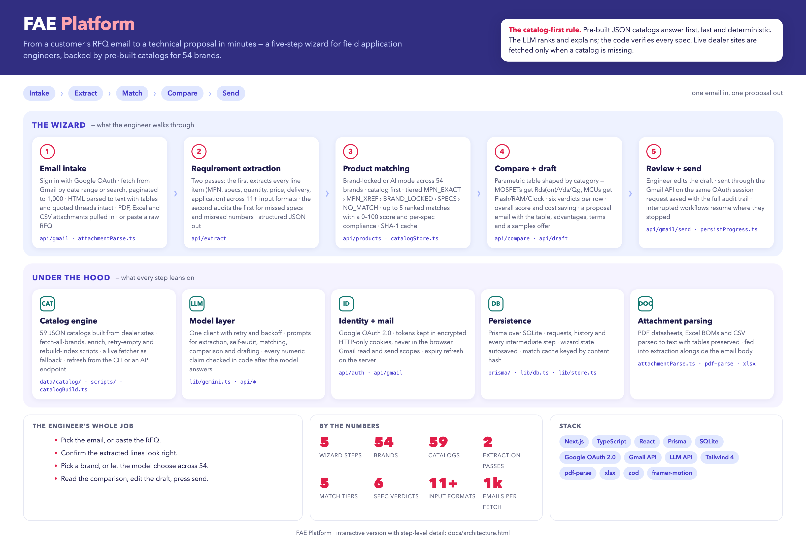

# fae-platform

An AI-assisted workbench for field application engineers at an electronic components distributor. It takes a customer's RFQ email and produces a technical proposal: every requirement extracted and self-audited, matched against pre-built catalogs for 54 brands, compared spec by spec against the customer's reference part, and drafted as an email the engineer reviews and sends from the same Gmail session. Minutes, not hours.

Company identity and the deployment URL are placeholders in this copy; the code is otherwise as deployed.



> **The catalog-first rule.** Pre-built JSON catalogs answer first, fast and deterministic. The LLM ranks and explains; the code verifies every spec. Live dealer sites are fetched only when a catalog is missing.

Interactive version with step-level detail: [docs/architecture.html](docs/architecture.html).

## By the numbers

| | |
|---|---|
| TypeScript | ~8,900 lines across 55 files |
| Wizard | 5 steps, resumable |
| Catalog | 54 brands, 59 catalog files, refresh from CLI or API |
| Extraction | 2 passes, 11+ input formats |
| Matching | 5 tiers, up to 5 ranked candidates, 0–100 score |
| Comparison | 6 verdicts per spec row |

## The wizard

1. **Email intake.** Sign in with Google OAuth. Fetch from Gmail by date range or search, paginated up to 1,000. HTML is parsed to text with tables and quoted threads intact; PDF, Excel and CSV attachments come along. Or paste a raw RFQ.
2. **Requirement extraction.** Two passes. The first extracts every line item (MPN, specs, quantity, price, delivery, application) from any of 11+ formats, including 50-line BOMs. The second audits the first for missed specs and misread numbers. Output is structured JSON.
3. **Product matching.** Brand-locked mode searches one brand's catalog; AI mode picks the best brands from the portfolio by keyword scoring, then searches across them. Tiered: `MPN_EXACT` › `MPN_XREF` › `BRAND_LOCKED` › `SPECS` › `NO_MATCH`. Up to five ranked matches with a score and per-spec compliance flags. Results cached by content hash.
4. **Compare and draft.** A parametric table shaped by category: MOSFETs get Rds(on), Vds and Qg; MCUs get Flash, RAM and clock; relays get contact rating and coil voltage. Each row is `MEETS`, `EXCEEDS`, `GAP`, `CLOSE`, `COMPATIBLE` or `APP-SAFE`. Overall score, total cost saving, then a proposal email with the table, numbered advantages, commercial terms and a samples offer.
5. **Review and send.** The engineer edits the draft and sends through the Gmail API on the same OAuth session. Every request is saved with its full audit trail, and an interrupted workflow resumes where it stopped.

## Under the hood

- **Catalog engine.** 59 JSON catalogs built from dealer sites by `fetch-all-brands`, `enrich-catalog`, `retry-empty` and `rebuild-index`. A live fetcher is the fallback. Refresh from `npm run catalog:refresh` or the API.
- **Model layer.** One client with retry and backoff, driving extraction, self-audit, matching, comparison and drafting. Every numeric claim is checked in code after the model answers.
- **Identity and mail.** Google OAuth 2.0. Tokens live in encrypted HTTP-only cookies, never in the browser. Gmail read and send scopes, with server-side refresh on expiry.
- **Persistence.** Prisma over SQLite for requests, history and every intermediate step. Wizard state autosaves.
- **Attachment parsing.** PDF datasheets, Excel BOMs and CSV to text with tables preserved.

## Repository layout

```
src/app/api/       extract · products · compare · draft · recommend · availability · catalog · gmail · auth · requests
src/app/wizard/    the five-step workflow
src/app/catalog/   catalog management UI
src/app/history/   request history
src/components/    step components, sidebar, step indicator
src/lib/           model client, dealers, catalog build/store, dealer fetch, attachment parse, db, store
data/catalog/      pre-built brand catalogs (JSON)
prisma/            schema, migrations, seed
scripts/           catalog refresh and enrichment
```

## Running it

```bash
npm install
# .env.local: GOOGLE_CLIENT_ID, GOOGLE_CLIENT_SECRET, NEXTAUTH_URL, GROQ_API_KEY, GROQ_MODEL
npx prisma migrate dev
npx prisma db seed
npm run dev            # http://localhost:3000
```

Rebuild catalogs with `npm run catalog:refresh`, or `catalog:refresh:force` to ignore the cache.

## What is not in this copy

The company name in prompts and copy, the deployment hostname, and the catalog build logs. Placeholders or excluded here.
